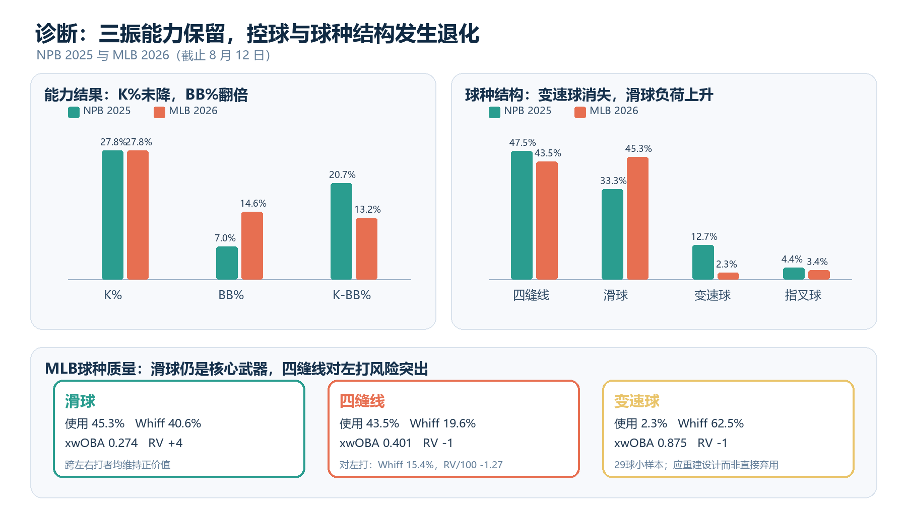

# MLB Analytics：今井达也调整决策研究

本仓库是棒球数据分析课程项目，回答：**今井达也进入 MLB 后的主要问题是什么，球队应如何安排其短期角色、球种组合与重返先发的门槛？**

研究使用冻结至 2026-08-12 的 MLB 数据，并以 2018—2025 年 NPB 表现作为历史基准。项目强调可追溯性：核心主张必须能够回到原始快照、处理脚本、分析表或明确标注的研究推断。

## 核心结论

- 今井的三振与挥空能力仍然存在；主要瓶颈是保送率上升以及首球、好球区控制下降。
- MLB 阶段四缝线与滑球占比过高；NPB 2025 已经成熟的变速球在 MLB 的使用率和速度分层明显下降。
- 四缝线的问题主要集中在对左打者，不能据此笼统减少对所有打者的使用。
- 两次牛棚登板只提供积极的小样本过程信号，不能证明永久转任后援更优。
- 建议以多局牛棚作为短期校准环境，并依据预先声明的控球、球种与负荷门槛逐级返回先发。



## 冻结研究范围

| 项目 | 冻结值 |
|---|---|
| MLB 主分析窗口 | 2026-03-29 至 2026-08-12（含首尾日期） |
| NPB 历史范围 | 2018—2025 |
| NPB 重点基准 | 2025 |
| NPB Basement 明细 | 2023—2025 |
| MLBAM pitcher id | 837227 |

机器可读配置见 [`config/analysis.json`](config/analysis.json)。

## 项目结构

```text
MLB-Analytics/
├─ .github/workflows/   # 冻结离线复现的持续集成
├─ config/              # 冻结窗口、球员标识和决策门槛
├─ data/
│  ├─ raw/              # 原始来源快照及 SHA-256 清单
│  └─ processed/        # 清洗、对账与分析用表
├─ docs/
│  ├─ research/         # 研究协议、来源、假设和分析循环
│  └─ reproducibility.md
├─ outputs/figures/     # 最终诊断图
├─ reports/
│  ├─ sources/          # 可审查 Markdown 单一文本源
│  └─ public/           # 不含学号等敏感信息的公开交付物
├─ scripts/             # 流水线、获取、分析、报告生成与校验
├─ tests/               # 离线单元与完整性测试
└─ qa/                  # 数据闭合与质量保证结果
```

## 快速开始

需要 Python 3.12。建议始终在项目自己的虚拟环境中运行。

Windows PowerShell：

```powershell
py -3.12 -m venv .venv
.\.venv\Scripts\python.exe -m pip install --upgrade pip
.\.venv\Scripts\python.exe -m pip install -r requirements.txt
```

macOS / Linux：

```bash
python3.12 -m venv .venv
./.venv/bin/python -m pip install --upgrade pip
./.venv/bin/python -m pip install -r requirements.txt
```

### 使用冻结快照离线复现

正常复现不访问网络，也不覆盖 `data/raw/`：

```powershell
python scripts/run_pipeline.py
python -m unittest discover -s tests -v
```

如需逐步执行，等价核心阶段为 `analyze.py`、`build_reports.py` 和 `verify_project.py`。

数据闭合、来源哈希和文档结构检查见：

```powershell
python scripts/verify_project.py
```

文档页数与视觉检查需要先完成 DOCX→PDF→逐页图片渲染；平台差异和完整步骤见 [`docs/reproducibility.md`](docs/reproducibility.md)。

### 显式刷新联网数据

只有需要建立新的数据冻结点时才执行：

```powershell
python scripts/run_pipeline.py --refresh-data
```

该命令会先显式调用 `fetch_data.py --refresh-data`，访问外部站点并覆盖 raw 快照及来源清单，随后重跑分析、报告与完整性校验。刷新可能改变结果，必须在独立提交中说明新截止日期和数据差异。

GitHub Actions 对每次 push 和 pull request 运行相同的冻结离线流程与测试；CI 不联网抓取数据，也不把人工视觉检查伪装成自动结论。

## 主要交付物

- [`reports/sources/formal_manuscript.md`](reports/sources/formal_manuscript.md)：两页正式稿的可审查文本源。
- [`reports/sources/full_analysis_draft.md`](reports/sources/full_analysis_draft.md)：完整分析底稿文本源。
- [`reports/public/今井达也_MLB调整决策_正式文稿.docx`](reports/public/今井达也_MLB调整决策_正式文稿.docx)：课程正式文稿。
- [`reports/public/今井达也_MLB调整决策_完整分析底稿.docx`](reports/public/今井达也_MLB调整决策_完整分析底稿.docx)：完整分析底稿。
- [`qa/data_reconciliation.csv`](qa/data_reconciliation.csv)：逐球数据与官方比赛日志对账。
- [`qa/integrity_report.json`](qa/integrity_report.json)：自动完整性检查结果。

## 数据来源与证据边界

数据来自 MLB StatsAPI、Baseball Savant、NPB 官方、NPB Basement 与 MLB.com。来源 URL、抓取时间和 SHA-256 见 `data/raw/source_manifest.*`，详细口径见 [`data/README.md`](data/README.md)。

NPB 与 MLB 的用球、球场、打者和统计模型不同；跨联盟球种价值只比较方向。牛棚样本和 MLB 变速球样本都很小，因此仓库不作未经证据支持的因果断言。

## 许可与公开范围

本仓库目前**未附开源许可证**。除法律另有规定外，不应据此推定代码、文档或其他原创内容已获得复制、修改或再分发许可。

`data/raw/` 中的第三方网页、接口响应和统计快照仅为课程研究的可复现留档；相应名称、内容和数据权利仍归各原始提供方。本仓库不对第三方材料重新授权。公开版本不应包含学号、联系方式等不必要的个人信息。
